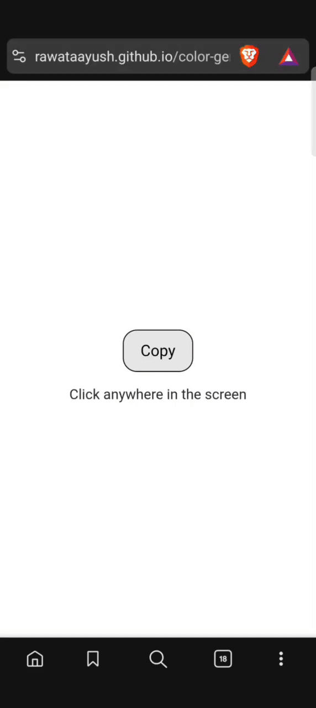

# 🎨 Awesome Color Generator

A simple and clean web application that generates random colors and allows you to instantly copy their RGB code. This project was built to practice JavaScript DOM manipulation and event handling.


---

### ✨ [View Live Demo](https://rawataayush.github.io/color-genrator/)



---

## 🚀 Key Features

* **Random Color Generation:** Generate a new random color with a single button click.
* **Copy to Clipboard:** Easily copy the color's HEX code to your clipboard with one click.
* **Clean UI:** A minimal and responsive design that displays the color and its code clearly.

---

## 💻 Technologies Used

* **HTML5:** For the basic structure and content.
* **SCSS (Sass):** For advanced and organized styling, compiled to CSS.
* **JavaScript (ES6+):** For all interactivity, including color generation and copy-to-clipboard functionality.

---

 ## 🔧 How to Use

To run this project locally, follow these simple steps:

1. **Clone the repository**
     ```sh
     git clone [https://github.com/rawataayush/color-generator.git](https://github.com/rawataayush/color-generator.git)
     ```
2.  **Navigate to the project directory:**
     ```
     cd color-generator
     ```
3.  **Open the  `index.html` file in your browser:**
    Simply double-click on the  `index.html` file, or right-click and select "Open with..." your preferred browser.

 ---

## 💡 What I Learned

Building this project helped me solidify my understanding of:
* JavaScript DOM manipulation (selecting and changing elements).
* Handling click events with Event Listeners.
* Writing funcitons to generate random values.
* Using the modern `navigator.clipboard` API for copy-paste functionality.

---

## 📄 License

This project is licensed under the MIT License. See the [LICENSE](LICENSE) file for details.
  
